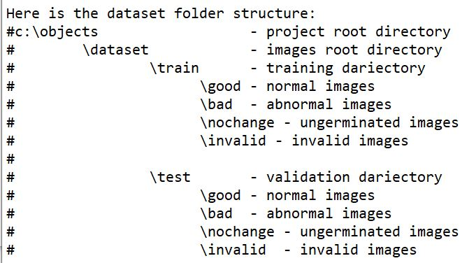

<i>(Please note that this project is designed for image classification purposes. The data preparation stage becomes essential since all objects are present within the same image. However, if your datasets originate from diverse sources, you may bypass this stage but keep in mind to copy the folder structure. The system is capable of classifying a minimum of four distinct objects. For instance, if your intention is to train the system to distinguish between cats, dogs, horses, and monkeys, you will need to gather a minimum of 200 sample images, each measuring 224 x 224 pixels. To enhance the dataset, you can employ techniques such as flipping, adjusting brightness, and rotation, thereby generating additional images.)</i>
<H1>Object Detection and Classifier using CNN</H1>
 <b></b>Data Preparation</b>

1. Create a project directory, such as "c:\objects."

2. Inside the project directory, create a folder specifically for your dataset, naming it "dataset."

3. Organize the files within the dataset folder according to a specific structure or format to ensure consistency and ease of use.

4. Extract the images using the program <b>"edge_detect8.py"</b>, which must be saved to the project root directory along with the raw images. This program will save the images to the root directory for further classification. Users must manually identify which images are "good," "bad," "no change," or "invalid," and save them to the appropriately named folder.

5.Transform all collected images to have the same size (224x224 pixels) using the program <b>"edge_detect.py"</b>, which must also be saved to the project directory. To do this, create a "processed" folder in each of the image class folders ("good," "bad," "no change," "invalid"). Users should provide the appropriate source directory and the processed directory, e.g., "c:\objects\dataset\train\good" for the source directory and "c:\objects\dataset\train\good\processed" for the new transformed image. The images are now ready to be used as datasets for the machine learning program, but the old images must be archived, and the processed images must be moved to the appropriate folder, like in our example, should be moved to "c:\objects\dataset\train\good." If the collected images are not enough, several programs are available that operate almost the same way as <b>"edge_detect.py"</b> but are designed to perform specific tasks, such as rotating the image (<b>"edge_detect4.py"</b>), flipping the image (<b>"edge_detect6.py"</b>), or adjusting the image brightness (<b>"edge_detect9.py"</b>). The latter three programs need not be saved to the processed folder; instead, specify the destination folder the same as the source folder because the program appends specified characters at the beginning of each newly created image to avoid overwriting the source images.

<b>Libraries Used and Versions:</b>
 cv2(opencv): 4.7.0
 keras: 2.7.0
 tensorflow: 2.7.0
 numpy: 1.22.4
